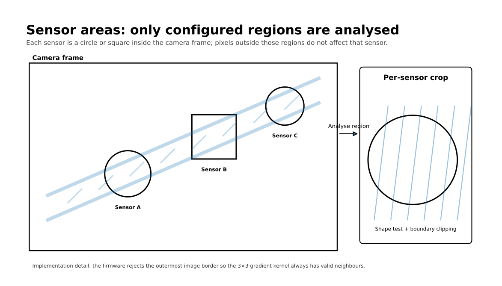
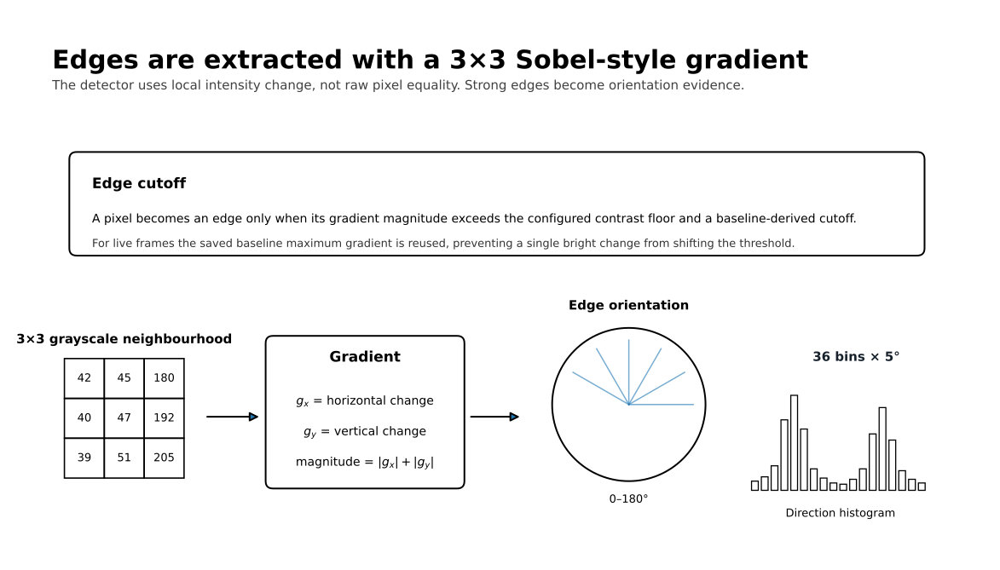
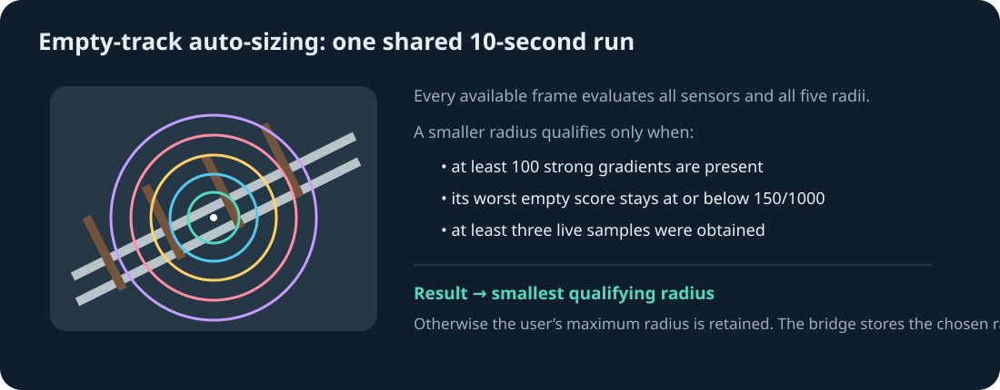
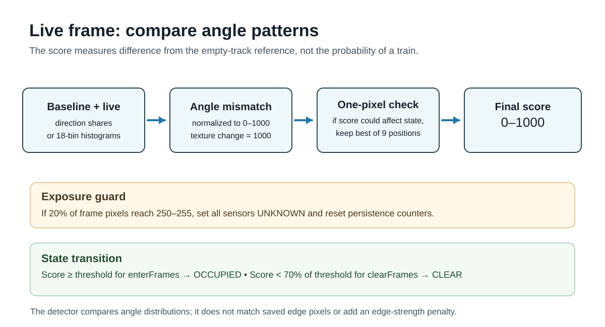

# Camera-based Model Railway Occupancy Detection

> [!WARNING]
> **Active development — not ready for download or operational use.** Firmware protocols, saved baseline formats, calibration rules and setup applications are still changing. Current builds are intended for development and bench testing only; do not rely on them for unattended railway operation.

Monitor model railway occupancy using cameras, without modifying the track or rolling stock. Each camera compares selected areas of the layout with an empty-track baseline and reports **clear**, **occupied**, or **unknown** states for virtual sensors and blocks. A bridge publishes these states to an MQTT broker for use by railway control software such as JMRI.

## System overview

The system has three components:

- **Camera modules:** supported ESP32 camera boards that process images locally and report sensor and block states wirelessly over ESP-NOW.
- **Bridge controller:** a Wi-Fi-capable ESP32 that connects the cameras to your Wi-Fi network and MQTT broker, and provides a USB serial connection for setup.
- **Setup application:** the [web app](https://davidgoddard.github.io/railway2026/) or the [desktop app](Bridge_Controller/README.md), used to configure cameras, define sensors and blocks, and view their states.


Camera modules need power and communicate with the bridge without data cables. After configuration, the bridge also needs only power; the setup computer can be disconnected.

## ESP32 hardware requirements

The detector and sensor state logic are hardware independent. Camera capture and radio communication still depend on facilities provided by the selected ESP32 and board. Selecting an ESP32 target in Arduino does not by itself provide a camera pin map, a camera driver, PSRAM, or an ESP-NOW-capable radio.

### Bridge controller

The bridge sketch has no fixed GPIO assignments and is not tied to the ESP32-C3 instruction set. It requires:

- a 2.4 GHz Wi-Fi interface supported by Arduino-ESP32 3.x, including ESP-NOW;
- enough RAM for Wi-Fi, MQTT, camera records, configuration staging, and snapshot transfer;
- a flash partition containing LittleFS;
- a USB CDC or USB-to-UART serial connection visible to the setup application at 115200 baud; and
- the PubSubClient Arduino library.

The ESP32-C3 SuperMini is the tested and documented bridge target. Original ESP32/WROOM boards and suitable ESP32-S2, ESP32-S3, ESP32-C5, and ESP32-C6 boards should use the same sketch when their Arduino board profile, serial route, and flash partition are configured correctly. The eight-camera limit is a conservative C3 RAM limit in the sketch, rather than a C3 hardware dependency. ESP32-H2 has no Wi-Fi and cannot run this bridge. ESP32-P4 has no integrated radio and can run it only when a supported external Wi-Fi companion supplies every Wi-Fi and ESP-NOW API used by the sketch.

### Camera modules

Every camera target must provide:

- a supported camera sensor, electrical interface, and pin map;
- a driver that can deliver grayscale, row-major, one-byte-per-pixel frames to `ImageSource`;
- PSRAM large enough for the selected frame plus detector state;
- a LittleFS partition for configuration and calibrated baseline features; and
- an ESP-NOW-capable 2.4 GHz radio, either integrated or exposed completely by a companion processor.

The same `OccupancyDetector` is used on every target. Hardware-specific image acquisition belongs in `ImageSource`; the detector, cell configuration, baseline comparison, persistence rules, and sensor messages do not change. The current image-source implementations support the AI Thinker ESP32-CAM and ESP32-S3-EYE DVP pin maps. Another DVP board needs its own verified pin map. A different camera interface needs an `ImageSource` adapter that produces the same grayscale buffer contract.

The setup application can auto-size sensors in one ten-second empty-track calibration. Each current radius is treated as a maximum, five nested radii are tested at the fixed user-selected centre, and the camera returns the smallest stable choice plus an individual clear-state threshold. After the first run, users can tune only sensors added since the last successful auto-size or deliberately retune all sensors. The bridge persists sensor creation revisions and the last auto-size revision, so later manual radius and threshold adjustments are not mistaken for new sensors.

ESP32-P4 camera hardware is capable of DVP, MIPI-CSI, SPI, and USB camera input through Espressif's [ESP Video components](https://docs.espressif.com/projects/esp-video-components/en/latest/esp32p4/Get_Started/index.html). It does not use the legacy `esp_camera` path used by the current ESP32 and S3 adapters. P4 boards also require a radio companion. Stock ESP-Hosted provides ordinary Wi-Fi through common P4 companion arrangements, but the existing railway camera protocol also requires ESP-NOW. P4 support must therefore include both an ESP Video image-source adapter and a verified route through companion firmware for the ESP-NOW packets.

## Camera module choices

The project has three useful camera hardware levels. They run the same detector and configuration model, while image acquisition and radio access are supplied by hardware adapters.

### Classic ESP32-CAM

The AI Thinker ESP32-CAM is the smallest and least expensive option. It uses the original ESP32, an OV2640 DVP camera, the `esp_camera` Arduino driver, integrated 2.4 GHz Wi-Fi/ESP-NOW, and external PSRAM. The repository contains its camera pin map. It is suitable for modest resolutions and sensor counts, but capture and processing speed are limited. Most boards need an external USB-to-UART adapter for programming and serial diagnostics.

### ESP32-S3 camera

The ESP32-S3-EYE is the current higher-performance Arduino target. It still uses a DVP camera through `esp_camera`, while providing a faster processor, more capable DMA and vector instructions, native USB on suitable boards, integrated Wi-Fi/ESP-NOW, and commonly more PSRAM. The repository contains the S3-EYE pin map. Other S3 camera products can use the same detector, but need a verified sensor pin map and PSRAM configuration because there is no universal “ESP32-S3 camera” wiring standard.

### Waveshare ESP32-P4-Module-DEV-KIT

The selected P4 target is the [Waveshare ESP32-P4-Module-DEV-KIT](https://docs.waveshare.com/ESP32-P4-Module-DEV-KIT). Its module combines an ESP32-P4NRW32, 32 MB PSRAM, 16 MB flash, and an ESP32-C6 radio coprocessor connected over SDIO. The development board has a two-lane MIPI-CSI connector; the DEV-KIT-A package includes a supported OV5647 camera. A ribbon connector alone does not establish compatibility, so development will use the Waveshare OV5647 as the reference sensor.

This is a different capture backend rather than a larger ESP32-CAM. The P4 should acquire frames using ESP-IDF 5.5.x, `esp_video`, `esp_cam_sensor`, MIPI-CSI and the ISP. Large reusable capture buffers belong in PSRAM. The adapter must convert the selected ISP output into the detector's grayscale, row-major, one-byte-per-pixel input without changing `OccupancyDetector` or the sensor protocol. Waveshare recommends ESP-IDF for stable access to the P4 multimedia peripherals; its [camera example](https://github.com/waveshareteam/ESP32-P4-Platform/tree/main/examples/esp-idf/16_video_lcd_display) shows the board's MIPI-CSI and OV5647 setup.

The P4 contains no Wi-Fi radio. The onboard C6 normally runs ESP-Hosted slave firmware and exposes ordinary Wi-Fi to a P4 host application through `esp_hosted` and `esp_wifi_remote`. That stock arrangement is sufficient for IP networking but must not be assumed to carry ESP-NOW. Until the P4-to-C6 ESP-NOW adapter has been implemented and tested, this board is a defined development target rather than a drop-in replacement for the two Arduino camera builds.

### Flashing the Waveshare P4 board

There are two processors, but the normal Waveshare application workflow does not require two project sketches:

1. Install the supported ESP-IDF 5.5.x toolchain and open its terminal.
2. Connect the board's P4 programming/debug USB-C port. The other USB-C connector may also power the board; use the connector identified by Waveshare for program flashing and debugging.
3. From the P4 firmware project, select the target once with `idf.py set-target esp32p4`.
4. Select the OV5647 sensor and the board's MIPI-CSI/ISP options in `idf.py menuconfig`. Keep PSRAM enabled.
5. Build with `idf.py build`.
6. Flash and open the log with `idf.py -p PORT flash monitor`, replacing `PORT` with the board's serial device. Use the BOOT and RESET buttons to enter download mode if automatic reset does not do so. Exit the monitor with `Ctrl-]`.

That command writes the railway application to the P4's flash. The onboard C6 normally retains its preinstalled ESP-Hosted slave firmware and is not reflashed on every P4 application update.

If the railway ESP-NOW transport requires custom C6 firmware, there will be **two firmware images**, though they are better described as two ESP-IDF firmware projects rather than two Arduino sketches:

- the P4 camera and detector application; and
- the C6 radio firmware that forwards the railway packet protocol between the P4 and ESP-NOW.

The C6 image is flashed separately through the board's ESP32-C6 UART header while the C6 is held in its download mode. Do not erase or replace the factory C6 image until the custom radio firmware, recovery procedure, UART/SDIO transport, and exact flash command have been validated on the physical board. Replacing it can remove the hosted Wi-Fi service used by the P4. The C6 radio image should normally change much less often than the P4 detector image.

## Getting started

1. Install the [camera firmware](Camera_Module/README.md) and [bridge firmware](Bridge_Controller/README.md), following their hardware and upload instructions. Supported camera pin maps currently cover the AI Thinker ESP32-CAM and ESP32-S3-EYE. Check the requirements above before choosing another ESP32 or camera board.
2. Mount and power each camera so that the monitored track is clearly visible. Keep the camera fixed and provide consistent lighting.
3. Connect the bridge to your computer by USB. Open the [web setup app](https://davidgoddard.github.io/railway2026/) in desktop Chrome or Edge, choose its USB device, and connect to the bridge. The desktop app is also available; see the [bridge guide](Bridge_Controller/README.md).
4. Select each discovered camera, fetch a frame, and draw sensor areas over the track. Combine sensors into blocks where needed, then save the configuration.
5. With all monitored track clear, run **Auto-size empty track** for each camera. Choose **new sensors only** for an initial run or after adding sensors; choose **all sensors** only when you intend to replace every automatically chosen radius and threshold. The shared ten-second run also creates the compatible baseline. Manual baseline capture remains available when sensor sizes and thresholds are already settled.
6. Configure the bridge's Wi-Fi and MQTT connection. Check sensor and block transitions with your rolling stock in the setup app and in your railway control software.
7. Leave the cameras and bridge powered for normal operation. Reconnect the setup app whenever you need to change settings or inspect the system.

Detection response time depends on the camera board, image resolution, sensor size and count, and configured persistence settings. Check performance with your layout and train speeds when positioning sensors. Fetching a setup snapshot pauses camera monitoring during the transfer.

## Why consider cameras?

Traditional model railway detection works well, but its cost and installation effort grow with the number of places monitored. The comparison below uses **indicative UK component prices checked in September 2026**, before postage, power supplies, wiring, interfaces, installation, and any rolling-stock modifications. Prices vary by supplier and board specification.

| Method | Indicative component cost | Installation and detection trade-off |
| --- | --- | --- |
| DCC track-current sensing | [About £30 for a four-block detector board](https://www.coastaldcc.co.uk/products/rr-cirkits/feedback/), plus sensing coils and feedback hardware | Detects current-drawing stock within electrically isolated track sections. Requires track wiring and suitable loads in stock to be detected. |
| Reed switch and magnet | [About £0.85 for a bare switch and £0.24–£0.36 per small magnet](https://www.railwayscenics.com/reed-switches-magnets-c-20_27_69.html) | Cheap point detection, but needs a switch and wiring at each location and a magnet on each vehicle that should trigger it. A passing pulse does not itself prove a whole block remains occupied. |
| Infrared sensor or break beam | [About £3.50 for a reflective sensor](https://thepihut.com/products/infrared-proximity-sensor) or [£5.20 for a break-beam pair](https://thepihut.com/products/ir-break-beam-sensor-5mm-leds) | Detects at a particular position without altering rolling stock; needs mounting, power, and wiring at each sensing point. Reflective readings depend on the target and environment. |
| ESP32 camera module | Modules are advertised at **around £5 each**; one [ESP32-S3 camera listing is £5.95](https://www.fruugo.co.uk/search?brand=Unbranded&merchantId=24938&pageSize=128&sorting=nameasc&whcat=3416) | One mounted camera can cover multiple virtual sensors and blocks without cutting rails or attaching magnets. It still needs power, a mount, a controller, and reliable sightlines and lighting. |

One camera can reduce hardware and wiring **per monitored area** when its view covers several locations. Plan camera coverage around sightlines, image detail, lighting, and processing capacity. Include power supplies, mounts, and the bridge when comparing installed costs. Current sensing, reed switches, and infrared are also useful where their detection properties suit the layout.

## How the camera firmware detects changes

The detector does **not** ask whether every live pixel is identical to the reference image. That would be too sensitive to normal camera noise, small exposure changes, and gradual lighting drift. Instead, each configured sensor area is reduced to 36 proportions: twelve fixed physical-line directions at 15° intervals, each divided into three coarse position bands. The detector also records the total number of strong gradients so an obstruction cannot appear unchanged merely by preserving a dominant direction.

A useful way to think about the process is:

```text
camera frame
   ↓
configured sensor area
   ↓
edge strength + edge direction
   ↓
compact baseline features  ← captured while the track is known to be clear
   ↓
compare each live frame with that baseline
   ↓
change score from 0 to 1000
   ↓
enter/clear persistence rules
   ↓
CLEAR or OCCUPIED
```

The algorithm is intentionally local. A train, hand, shadow, scenery change, or other disturbance only matters to a sensor if it changes the edge directions **inside that sensor's configured area**. It does not fit a continuous line or compare saved edge-pixel locations.

### 1. Analyse only the configured sensor area

Each sensor is defined by a centre point, a radius and a shape. The firmware supports circular and square cells. Although the camera captures a complete grayscale frame, the detector walks only the pixels that belong to the sensor being analysed.



This has two benefits. First, one camera can monitor several independent locations without treating the whole image as a single detector. Second, processing time is spent only on the parts of the frame that matter.

The edge calculation uses a 3×3 neighbourhood around each pixel, so the outermost image border is deliberately excluded. That guarantees that the algorithm can safely inspect the neighbouring pixels above, below and to either side of every analysed point.

> A sensor area is similar to a virtual electronic detector drawn on the camera image. Moving something elsewhere in the picture should not affect that sensor.

### 2. Convert brightness changes into edges

For every pixel inside a sensor, the firmware applies a small 3×3 **Scharr gradient** calculation. This estimates how quickly brightness changes horizontally and vertically around that point. Scharr weights the nearest horizontal and vertical neighbours more strongly than the corners, giving more consistent angle estimates than Sobel for diagonal edges in small sensor areas. The result is normalized to the former Sobel scale so configured contrast floors retain their meaning.



The two gradient components are called `gx` and `gy`. The implementation uses their absolute values to form a simple edge-strength measure:

```text
edge strength = |gx| + |gy|
```

A flat piece of image, where neighbouring pixels have almost the same brightness, produces a small value. A rail edge, sleeper edge, wagon outline or other sharp transition produces a larger value.

Not every gradient is retained. The firmware calculates an edge cutoff using the larger of:

- the configured **contrast floor**; and
- one fifth of the reference area's maximum gradient.

For live frames, that second term comes from the **saved baseline**, rather than being recalculated from the live frame. This is important: a newly introduced bright object should not be allowed to raise the threshold that is being used to detect that same object.

For retained edges, the algorithm also measures physical line direction from 0° to 180°. Opposite gradient signs represent the same physical line, so an edge has an orientation rather than a one-way heading. Each edge is assigned to the nearest fixed direction bucket centred at 0°, 15°, …, 165°; the 0° bucket wraps across 180°.

> The detector is interested less in the exact shade of a rail or sleeper and more in the pattern of strong lines and boundaries visible in the area.

### 3. Capture an empty-track baseline

A baseline is captured when the monitored area is in its known **clear** condition. The camera captures three consecutive fresh frames and forms their per-pixel mean before calculating any gradients. This reduces random sensor and exposure noise in the reference. The firmware then analyses every configured sensor and stores compact measurements rather than retaining the complete mean image for normal comparison.

For each sensor, the baseline includes measurements such as:

- number of sampled pixels and detected edges;
- maximum gradient strength, used to set the edge cutoff;
- mean brightness and the number of almost-white pixels;
- all twelve fixed 15° direction buckets; and
- the proportion of edges assigned to three broad position bands for each direction.

A sensor is treated as textured once at least eight qualifying edges are found. Every retained edge contributes even when its direction is weak relative to a dominant rail or scenery boundary; there is no dominant-family support test and no “other directions” bucket. Each edge is projected onto the normal of its bucket's physical line and placed in side A, centre, or side B. The resulting 36 normalized direction/position proportions retain coarse geometry without exact edge coordinates.

> The baseline is a fingerprint of the clear scene. It records the important structure of the image, not a photographic copy that must match exactly.

### 4. Auto-size every sensor from one empty-scene run

The setup applications calibrate sensors on a camera in one shared ten-second operation. Sensor centres remain exactly where the user placed them. For each selected sensor, the current radius is treated as the maximum permitted size and the camera evaluates five nested candidate radii from the same frames.

The smallest radius qualifies only when it contains at least 100 strong gradients, obtains at least three live samples, and its worst observed empty-scene score remains at or below 150/1000. If no smaller candidate qualifies, the user's maximum radius is retained. Slow cameras contribute as many samples as they can process; faster cameras are capped at 50 temporally spaced samples.

The resulting per-sensor threshold is approximately twice the worst observed empty score plus a safety allowance of 100. It is rounded upward, capped at 800, and never allowed below 400 or below the sensor's existing threshold. **New sensors only** tunes sensors whose immutable creation revision is later than the last successful auto-size; other sensors retain manual radius and threshold adjustments. **All sensors** deliberately recalculates every sensor. Both choices refresh the complete empty baseline, and the application redraws the chosen circles.



Empty-only calibration estimates false-trigger behaviour; it cannot prove that every item of rolling stock will be detected. Test representative vehicles after calibration and adjust placement, maximum radius, threshold or persistence when the clear and occupied score ranges overlap.

### 5. Build the same features for each live frame

Once a baseline exists, each new frame is analysed using the same sensor geometry, saved gradient cutoff, twelve direction buckets and three position bands. The detector calculates total variation between the 36 normalized baseline and live bucket proportions. It also calculates the proportional change in the total number of strong gradients and uses the larger of the two values. This second component catches an obstruction that preserves a dominant line direction while removing much of the empty-track texture.

If both images are untextured, the score is zero; if only one is textured, the score is 1000. The direction/position comparison is normalized by edge count, while the separate edge-count component deliberately preserves a large loss or gain of texture.

### 6. Allow a one-pixel image shift

A small cell can change its apparent angle mix when the camera image moves by just one pixel. If the initial score could make a cell occupied, or keep an occupied cell from clearing, the detector checks up to eight neighbouring image positions. It keeps the lowest usable mismatch found and stops early if the score falls below the relevant threshold. The extra comparisons run only when needed, but may reduce frame rate if many cells regularly score high.

This is tolerance for small image movement, not a requirement that a particular edge pixel remain in place. A changed object with the same angle proportions as the empty scene can still be missed.

### 7. Convert the comparison into a 0–1000 change score

The normalized comparison produces a value between 0 and 1, which the firmware exposes as an integer score from **0 to 1000**:

```text
0      = closely matches the clear baseline
1000   = very strong difference from the baseline
```

The configured `thresholdPermille` decides how much difference is required before a frame counts as evidence of occupancy.



A score is therefore not a probability that a train is present. It is a **difference measure**: how unlike the saved clear condition the current sensor looks according to the available edge evidence.

### 8. Reject obviously unreliable exposure changes

A camera can temporarily produce a bad image because of glare, overexposure or a sudden lighting change. Treating such a frame as evidence of occupancy can create false transitions.

The camera supplies one grayscale value per pixel, rather than separate R, G, and B values. The firmware counts pixels at 250–255 across the **whole frame**. If at least 20% are near white, it treats that frame as overexposed. This is an absolute threshold, so a scene with a large naturally white area can also trigger it. There is no separate exposure-recovery timer: the first frame below this limit is analysed normally.

When a frame is judged overexposed, the detector reports **every sensor as unknown** rather than retaining a potentially stale clear or occupied result. It resets the consecutive-frame counters; useful visual evidence must then satisfy the configured count to establish a new state. The serial log prints the clipped-pixel count and percentage.

> "I cannot trust this image" is different from "the track is clear". Reporting unknown avoids presenting a stale occupied or clear state as a fresh observation.

### 9. Require repeated evidence before changing state

The raw score is deliberately separated from the final state. A single changed frame does not necessarily mean that a train has arrived; it could be noise, motion blur or a brief shadow. New sensors default to a 400/1000 mismatch threshold and one qualifying frame to occupy, prioritizing prompt detection. More frames can be configured to reject brief false triggers.

The detector therefore uses two persistence counters:

1. If the score is **at or above the configured threshold**, the `enter` counter advances. The sensor becomes `OCCUPIED` only after the configured number of consecutive enter frames.
2. If the score falls below **70% of the threshold**, the `clear` counter advances. The sensor becomes `CLEAR` only after the configured number of consecutive clear frames.
3. Scores between those two levels change neither state immediately. This creates hysteresis and prevents rapid toggling around the threshold.

At the new-sensor defaults, a score of at least 400 occupies the sensor on the first qualifying frame, while clearing requires scores below 280 for five consecutive frames. Existing saved sensors retain their configured threshold and frame counts until changed in the bridge app and saved.

This makes three settings conceptually different:

- **contrast floor** — how strong a local brightness transition must be before it can count as an edge;
- **change threshold** — how different the live edge structure must be from the clear baseline; and
- **enter/clear frame counts** — how long that evidence must persist before the reported state changes.

### 10. Combine sensors into blocks

The multi-cell firmware can associate several sensors with the same group or block. Individual sensors are analysed independently first. The group state is then derived from its members:

- if any member sensor is `OCCUPIED`, the group is `OCCUPIED`;
- otherwise, if any member is `UNKNOWN`, the group is `UNKNOWN`;
- otherwise the group is `CLEAR`.

The reported group score is the highest score among its member sensors. This makes a block conservative: one occupied member is enough to make the complete block occupied.

### Placement, lighting, and diagnostics

The detector uses railway geometry such as rails, sleepers, and vehicle outlines to identify changes while tolerating small grayscale variations. Each camera monitors several independent sensor areas.

Reliable detection depends on clear sightlines, stable camera mounting, suitable sensor placement, and consistent lighting. Shadows, reflections, camera or scenery movement, occlusion, and low-texture areas can affect results. Check both clear and occupied states with the rolling stock and lighting used on your layout, and adjust thresholds and persistence settings as needed. Recapture the baseline after changing the camera view or sensor configuration.

With debug output enabled, the camera reports baseline peak angles over USB serial. On a state transition, it reports the cell ID, change score, edge counts, and strongest gradients. When a sensor is selected, the setup app magnifies its raw pixels without smoothing and overlays the physical line directions found by the same baseline analysis used on the camera. Move or resize the sensor until the clear-track crop includes useful secondary texture such as sleepers or ballast, then save and capture the baseline. The setup app also displays live sensor states over the most recently fetched still frame; the image itself is not a live video feed.

The [camera guide](Camera_Module/README.md) describes configuration, baseline storage, and detector behaviour. The [bridge guide](Bridge_Controller/README.md) covers MQTT, setup controls, connection history, and troubleshooting.

## Reference documentation

| Path | Contents |
| --- | --- |
| [`Camera_Module/`](Camera_Module/) | Camera firmware, supported hardware, installation, and detector configuration. |
| [`Bridge_Controller/`](Bridge_Controller/) | Bridge firmware, desktop setup application, MQTT configuration, and troubleshooting. |
| [`Web_App/`](Web_App/) | Browser setup application and browser-specific capabilities and limitations. |
| [`Documentation/functional-specification.md`](Documentation/functional-specification.md) | Design reference, including proposed behaviour and open design decisions. |
| [`experiments/camera_module/`](experiments/camera_module/) | Separate development tool for inspecting angle histograms and timing; its scoring rules may differ from the camera firmware. |
