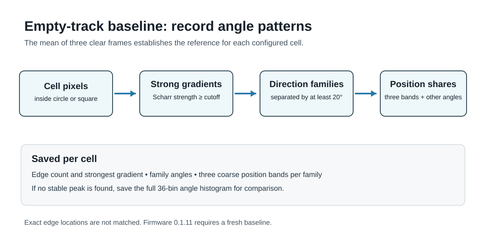

# Model Railway Occupancy toolkit using Cameras

An experimental toolkit for detecting occupation on a **model railway** using cameras instead of track or rolling-stock modifications. A camera watches selected parts of the layout and compares each new frame with an empty-track reference. The intended output is a clear, occupied, or unknown state for each virtual sensor or block.

This repository contains a browser-based camera algorithm experiment, a multi-cell camera firmware sketch, and a first ESP32 bridge controller. A first Electron setup application is in `Bridge_Controller`. The camera-to-bridge protocol has not yet been tested on hardware.

## Intended system

```text
Camera modules                         Controller                 Layout automation
ESP32-S3, local frame processing  →   ESP32-C3 SuperMini     →   MQTT broker and clients
compact state over ESP-NOW             state and health bridge

Setup application and temporary Wi-Fi hotspot: configuration, preview, diagnostics
```

Each camera will process images locally and report compact state and health messages over ESP-NOW. The controller will publish those states to MQTT. The first multi-cell sketch also supports an on-demand grayscale snapshot over ESP-NOW for setup and diagnosis; it pauses monitoring during this slow transfer. The [draft functional specification](Documentation/functional-specification.md) defines the proposed state model, network modes, failure handling, MQTT contract, and performance guardrails.

The target is **at least 10 fresh, analysed frames per second** at a resolution that makes rails and sleepers distinguishable, under the intended cell load and with the radio active. This is a target to test on hardware, not a measured capability of the current sketch.

## Why consider cameras?

Traditional model railway detection works well, but its cost and installation effort grow with the number of places monitored. The comparison below uses **indicative UK component prices checked in September 2026**, before postage, power supplies, wiring, interfaces, installation, and any rolling-stock modifications. Prices vary by supplier and board specification.

| Method | Indicative component cost | Installation and detection trade-off |
| --- | --- | --- |
| DCC track-current sensing | [About £30 for a four-block detector board](https://www.coastaldcc.co.uk/products/rr-cirkits/feedback/), plus sensing coils and feedback hardware | Detects current-drawing stock within electrically isolated track sections. Requires track wiring and suitable loads in stock to be detected. |
| Reed switch and magnet | [About £0.85 for a bare switch and £0.24–£0.36 per small magnet](https://www.railwayscenics.com/reed-switches-magnets-c-20_27_69.html) | Cheap point detection, but needs a switch and wiring at each location and a magnet on each vehicle that should trigger it. A passing pulse does not itself prove a whole block remains occupied. |
| Infrared sensor or break beam | [About £3.50 for a reflective sensor](https://thepihut.com/products/infrared-proximity-sensor) or [£5.20 for a break-beam pair](https://thepihut.com/products/ir-break-beam-sensor-5mm-leds) | Detects at a particular position without altering rolling stock; needs mounting, power, and wiring at each sensing point. Reflective readings depend on the target and environment. |
| ESP32 camera module | Modules are advertised at **around £5 each**; one [ESP32-S3 camera listing is £5.95](https://www.fruugo.co.uk/search?brand=Unbranded&merchantId=24938&pageSize=128&sorting=nameasc&whcat=3416) | One mounted camera could cover multiple virtual sensors and blocks without cutting rails or attaching magnets. It still needs power, a mount, a controller, and reliable sightlines and lighting. |

The camera approach may reduce hardware and wiring **per monitored area** when one view covers several locations. Its full installed cost and reliability are unproven: camera count, usable field of view, resolution, processing capacity, shadows, and occlusion must be measured on a real layout. Current sensing, reed switches, and infrared remain useful where their detection properties fit better.

## How the camera firmware detects changes

The detector does **not** ask whether every live pixel is identical to the reference image. That would be too sensitive to normal camera noise, small exposure changes, and gradual lighting drift. Instead, each configured sensor area is reduced to a compact description of its **edge directions**: the proportions of strong brightness transitions at each angle. The baseline records up to three well-supported directions; a cell without stable peaks uses the full angle distribution.

A useful way to think about the process is:

```text
camera frame
   ↓
configured sensor area
   ↓
edge strength + edge direction
   ↓
compact baseline features  ← captured while the track is known to be clear
   ↓
compare each live frame with that baseline
   ↓
change score from 0 to 1000
   ↓
enter/clear persistence rules
   ↓
CLEAR or OCCUPIED
```

The algorithm is intentionally local. A train, hand, shadow, scenery change, or other disturbance only matters to a sensor if it changes the edge directions **inside that sensor's configured area**. It does not fit a continuous line or compare saved edge-pixel locations.

### 1. Analyse only the configured sensor area

Each sensor is defined by a centre point, a radius and a shape. The firmware supports circular and square cells. Although the camera captures a complete grayscale frame, the detector walks only the pixels that belong to the sensor being analysed.


This has two benefits. First, one camera can monitor several independent locations without treating the whole image as a single detector. Second, processing time is spent only on the parts of the frame that matter.

The edge calculation uses a 3×3 neighbourhood around each pixel, so the outermost image border is deliberately excluded. That guarantees that the algorithm can safely inspect the neighbouring pixels above, below and to either side of every analysed point.

> **Teaching point:** a sensor area is similar to a virtual electronic detector drawn on the camera image. Moving something elsewhere in the picture should not affect that sensor.

### 2. Convert brightness changes into edges

For every pixel inside a sensor, the firmware applies a small 3×3 **Sobel-style gradient** calculation. This estimates how quickly brightness changes horizontally and vertically around that point.


The two gradient components are called `gx` and `gy`. The implementation uses their absolute values to form a simple edge-strength measure:

```text
edge strength = |gx| + |gy|
```

A flat piece of image, where neighbouring pixels have almost the same brightness, produces a small value. A rail edge, sleeper edge, wagon outline or other sharp transition produces a larger value.

Not every gradient is retained. The firmware calculates an edge cutoff using the larger of:

- the configured **contrast floor**; and
- one quarter of the reference area's maximum gradient.

For live frames, that second term comes from the **saved baseline**, rather than being recalculated from the live frame. This is important: a newly introduced bright object should not be allowed to raise the threshold that is being used to detect that same object.

For retained edges, the algorithm also measures direction from 0° to 180°. Opposite gradient signs represent the same physical edge direction, so an edge has an orientation rather than a one-way heading. When a full orientation histogram is needed, directions are accumulated into 18 bins of 10° each.

> **Teaching point:** the detector is interested less in the exact shade of a rail or sleeper and more in the pattern of strong lines and boundaries visible in the area.

### 3. Capture an empty-track baseline

A baseline is captured when the monitored area is in its known **clear** condition. The firmware analyses every configured sensor and stores compact measurements rather than retaining the complete reference image for normal comparison.



For each sensor, the baseline includes measurements such as:

- number of sampled pixels and detected edges;
- maximum gradient strength, used to set the edge cutoff;
- mean brightness and the number of almost-white pixels;
- up to three dominant edge directions;
- the proportion of edges assigned to those directions, including an “other directions” bucket.

A sensor is treated as having useful texture once at least eight qualifying edges are found. If a clear reference contains strong repeated geometry—rails are a good example—the orientation histogram normally contains obvious peaks. The firmware searches for up to three sufficiently strong, sufficiently separated peaks and refines their angles using neighbouring histogram bins.

Once dominant directions have been found, the reference edges are projected into a small set of buckets: one bucket for each dominant direction plus a catch-all bucket for edges that do not fit them. This gives the live detector a compact description such as "most strong edges still run approximately along these rail directions" without requiring pixel-for-pixel alignment.

> **Teaching point:** the baseline is a fingerprint of the clear scene. It records the important structure of the image, not a photographic copy that must match exactly.

### 4. Build the same features for each live frame

Once a baseline exists, each new frame is analysed using the same sensor geometry and gradient cutoff rules. The comparison method depends on what was found in the reference:

- **Reference with dominant directions:** live edges are assigned to the saved direction buckets and the proportions are compared.
- **Textured reference without reliable dominant peaks:** the smoothed 18-bin orientation histograms are compared instead.
- **Very weak reference and very weak live image:** the area is treated as unchanged rather than manufacturing a large score from sparse data.
- **One image textured and the other not:** this is treated as a strong change unless both frames have fewer than 16 edges and the baseline has no stable peak.

Both the bucket comparison and histogram comparison are normalized by the number of edges. That matters because the detector is comparing the *distribution* of edge structure, rather than simply assuming that a frame with more edge pixels must be occupied.

### 5. Allow a one-pixel image shift

A small cell can change its apparent angle mix when the camera image moves by just one pixel. If the initial score could make a cell occupied, or keep an occupied cell from clearing, the detector checks up to eight neighbouring image positions. It keeps the lowest usable mismatch found and stops early if the score falls below the relevant threshold. The extra comparisons run only when needed, but may reduce frame rate if many cells regularly score high.

This is tolerance for small image movement, not a requirement that a particular edge pixel remain in place. A changed object with the same angle proportions as the empty scene can still be missed.

### 6. Convert the comparison into a 0–1000 change score

The normalized comparison produces a value between 0 and 1, which the firmware exposes as an integer score from **0 to 1000**:

```text
0      = closely matches the clear baseline
1000   = very strong difference from the baseline
```

The configured `thresholdPermille` decides how much difference is required before a frame counts as evidence for occupation.


A score is therefore not a probability that a train is present. It is a **difference measure**: how unlike the saved clear condition the current sensor looks according to the available edge evidence.

### 7. Reject obviously unreliable exposure changes

A camera can temporarily produce a bad image because of glare, overexposure or a sudden lighting change. Treating such a frame as genuine occupation evidence can create false transitions.

The firmware therefore checks whether the live area has become substantially brighter than the reference and whether it is also heavily clipped to white or has lost previously visible edge detail. In the current implementation, the mean live brightness must be at least 25 grayscale levels above the reference before this guard can trigger; additional clipping or lost-detail tests must also be satisfied.

When the exposure is judged unreliable, the detector does **not** declare the area clear or occupied from that frame. It resets the consecutive-frame counters and preserves the existing state until useful visual evidence returns.

> **Teaching point:** "I cannot trust this image" is different from "the track is clear". Preserving the previous state is safer than turning bad camera exposure into a false clear indication.

### 8. Require repeated evidence before changing state

The raw score is deliberately separated from the final state. A single changed frame does not necessarily mean that a train has arrived; it could be noise, motion blur or a brief shadow.

The detector therefore uses two persistence counters:

1. If the score is **at or above the configured threshold**, the `enter` counter advances. The sensor becomes `OCCUPIED` only after the configured number of consecutive enter frames.
2. If the score falls below **70% of the threshold**, the `clear` counter advances. The sensor becomes `CLEAR` only after the configured number of consecutive clear frames.
3. Scores between those two levels change neither state immediately. This creates hysteresis and prevents rapid toggling around the threshold.

For example, with a threshold of 400, occupation evidence begins at a score of 400, while clear evidence requires a score below 280. If `enterFrames` is 3, three qualifying frames are required before the sensor changes to occupied.

This makes three settings conceptually different:

- **contrast floor** — how strong a local brightness transition must be before it can count as an edge;
- **change threshold** — how different the live edge structure must be from the clear baseline; and
- **enter/clear frame counts** — how long that evidence must persist before the reported state changes.

### 9. Combine sensors into blocks

The multi-cell firmware can associate several sensors with the same group or block. Individual sensors are analysed independently first. The group state is then derived from its members:

- if any member sensor is `OCCUPIED`, the group is `OCCUPIED`;
- otherwise, if any member is `UNKNOWN`, the group is `UNKNOWN`;
- otherwise the group is `CLEAR`.

The reported group score is the highest score among its member sensors. This makes a block conservative: one occupied member is enough to make the complete block occupied.

### What the algorithm is good at—and what still needs testing

The approach is designed to tolerate small grayscale variations better than direct image subtraction and to make use of strong railway geometry such as rails, sleepers and vehicle outlines. It should also allow one camera to service many independent virtual sensors.

It is still an experimental detector, not a proven lighting-independent sensor. Shadows, reflections, large lighting changes, camera movement, scenery movement, occlusion, low-texture areas and unsuitable sensor placement can all reduce reliability. The thresholds and persistence values therefore need to be validated using logs from the actual layout, lighting, camera position and rolling stock that will be used in service.

The production camera prints baseline peak angles and, on a state transition, the cell ID, final score, edge counts and strongest gradients over USB serial when debug output is enabled. The setup app shows individual cell states over a fetched still frame, but it does not yet show a per-frame score history or the angle distributions that caused a trigger. The separate browser experiment has more detailed angle histograms and timing logs. Use those diagnostics with empty-track and rolling-stock recordings to tune placement and thresholds.

The [camera module firmware](Camera_Module/README.md) contains this multi-cell detector, reports states to the [bridge controller](Bridge_Controller/README.md), and saves an explicitly captured baseline to camera flash. The browser experiment below is a separate sketch for exploring the ideas and may use different scoring rules.

### Try the browser experiment

1. Install the Espressif ESP32 Arduino core, select the appropriate camera board, and enable PSRAM.
2. Open `experiments/camera_module/camera_module.ino` in Arduino IDE and upload it. The default pin map is for the AI Thinker ESP32-CAM.
3. Join the `Railway-Angle-Lab` Wi-Fi hotspot and open `http://192.168.4.1/`. The experiment's default password is documented in the [camera guide](experiments/camera_module/README.md); change it in the sketch before use near other people.
4. Select a resolution, position a cell, and capture a reference while the area is empty. Change what the cell sees, then inspect the comparison and log.

The sketch version appears at the top of the `.ino` file, on the web page, and in Serial Monitor, so an uploaded build can be identified. For hardware and upload details, calibration steps, algorithm behaviour, and known limitations, see the [camera experiment guide](experiments/camera_module/README.md).

## Repository layout

| Path | Contents |
| --- | --- |
| [`Documentation/functional-specification.md`](Documentation/functional-specification.md) | Draft goals, architecture, behaviour, guardrails, and open decisions. |
| [`experiments/camera_module/`](experiments/camera_module/) | Arduino camera sketch and experiment instructions. |
| [`Camera_Module/`](Camera_Module/) | Multi-cell camera firmware and detector implementation. |
| [`Bridge_Controller/`](Bridge_Controller/) | Bridge firmware and setup application. |

## Next steps

1. Collect logs from stationary empty track under changing daylight, artificial light, and camera exposure; tune false-change behaviour before treating the algorithm as reliable.
2. Test resolution, frame rate, PSRAM use, and cell count on the chosen ESP32-S3 camera hardware.
3. Test the multi-cell block logic, snapshot transfer, persistence, and ESP-NOW state reporting against the bridge on real hardware.
4. Test and package the Electron setup application on macOS and Windows hardware, and add authenticated pairing according to the functional specification.

The specification deliberately marks unresolved design choices and acceptance scenarios. Results from the camera experiment should update it as the hardware and algorithm are validated.
