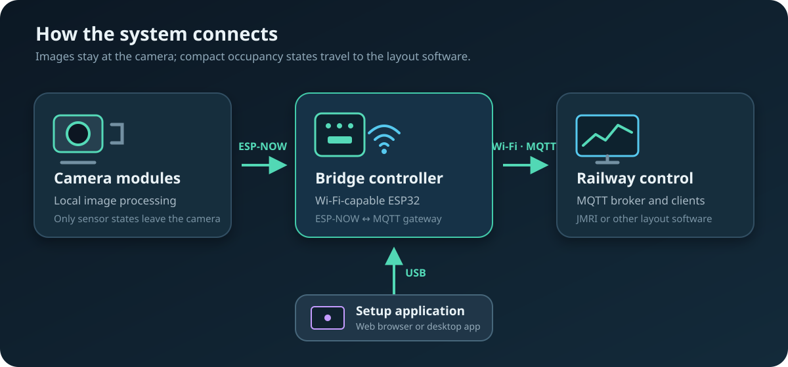
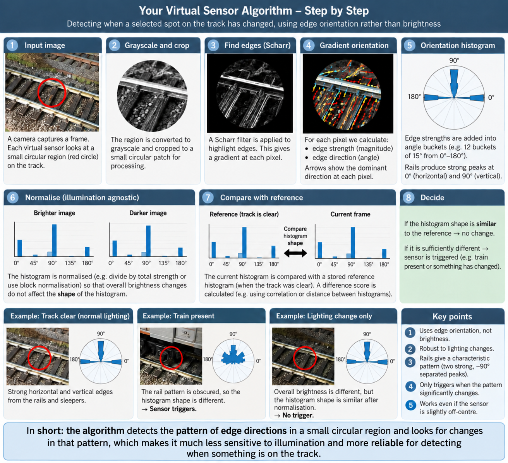

# Camera-based Model Railway Occupancy Detection

> [!WARNING]
> **Active development — not ready for download or operational use.** Firmware protocols, saved baseline formats, calibration rules and setup applications are still changing. Current builds are intended for development and bench testing only; do not rely on them for unattended railway operation.

Monitor model railway occupancy using cameras, without modifying the track or rolling stock. Each camera compares selected areas of the layout with an empty-track baseline and reports **clear**, **occupied**, or **unknown** states for virtual sensors and blocks. A bridge publishes these states to an MQTT broker for use by railway control software such as JMRI.

## System overview

The system has three components:

- **Camera modules:** supported ESP32 camera boards that process images locally and report sensor and block states wirelessly over ESP-NOW.
- **Bridge controller:** a Wi-Fi-capable ESP32 that connects the cameras to your Wi-Fi network and MQTT broker, and provides a USB serial connection for setup.
- **Setup application:** the [web app](https://davidgoddard.github.io/railway2026/) or the [desktop app](Bridge_Controller/README.md), used to configure cameras, define sensors and blocks, and view their states.

Camera modules need power and communicate with the bridge without data cables. After configuration, the bridge also needs only power; the setup computer can be disconnected.

## ESP32 hardware requirements

The detector and sensor state logic are hardware independent. Camera capture and radio communication still depend on facilities provided by the selected ESP32 and board. Selecting an ESP32 target in Arduino does not by itself provide a camera pin map, a camera driver, PSRAM, or an ESP-NOW-capable radio.

### Bridge controller

The bridge sketch has no fixed GPIO assignments and is not tied to the ESP32-C3 instruction set. It requires:

- a 2.4 GHz Wi-Fi interface supported by Arduino-ESP32 3.x, including ESP-NOW;
- enough RAM for Wi-Fi, MQTT, camera records, configuration staging, and snapshot transfer;
- a flash partition containing LittleFS;
- a USB CDC or USB-to-UART serial connection visible to the setup application at 115200 baud; and
- the PubSubClient Arduino library.

The ESP32-C3 SuperMini is the tested and documented bridge target. Original ESP32/WROOM boards and suitable ESP32-S2, ESP32-S3, ESP32-C5, and ESP32-C6 boards should use the same sketch when their Arduino board profile, serial route, and flash partition are configured correctly. The eight-camera limit is a conservative C3 RAM limit in the sketch, rather than a C3 hardware dependency. ESP32-H2 has no Wi-Fi and cannot run this bridge. ESP32-P4 has no integrated radio and can run it only when a supported external Wi-Fi companion supplies every Wi-Fi and ESP-NOW API used by the sketch.

### Camera modules

Every camera target must provide:

- a supported camera sensor, electrical interface, and pin map;
- a driver that can deliver grayscale, row-major, one-byte-per-pixel frames to `ImageSource`;
- PSRAM large enough for the camera-driver framebuffer, two application-owned grayscale frames, detector state, and one temporary averaging frame during baseline capture;
- a LittleFS partition for configuration and calibrated baseline features; and
- an ESP-NOW-capable 2.4 GHz radio, either integrated or exposed completely by a companion processor.

The same `OccupancyDetector` is used on every target. Hardware-specific image acquisition belongs in `ImageSource`; the detector, cell configuration, baseline comparison, persistence rules, and sensor messages do not change. The current image-source implementations support the AI Thinker ESP32-CAM and ESP32-S3-EYE DVP pin maps. Another DVP board needs its own verified pin map. A different camera interface needs an `ImageSource` adapter that produces the same grayscale buffer contract.

The setup application can size and tune sensors in one ten-second empty-track calibration. Each current radius is treated as a maximum, five nested radii are tested at the fixed user-selected centre, and the camera returns the smallest stable choice with coherent directional structure plus an individual clear-state threshold. The threshold is derived from that sensor's worst empty-scene score with a noise allowance. After the first run, the normal action tunes sensors added since the last successful calibration; **Recalibrate all sensors** deliberately replaces every automatic radius and threshold. The bridge persists sensor creation revisions and the last calibration revision, so later manual adjustments are retained by the new-sensors-only action.

For diagnosing a sensor that fires while the scene appears unchanged, follow the [sensor stability and false-trigger guide](Documentation/sensor-stability-guide.md).

## Application workflow

The web and desktop applications share the same workflow and terminology:

1. **Overview** shows bridge, connection, camera, calibration, and detector-test readiness, with the next recommended action for each camera.
2. **Cameras** keeps the camera image visible while sensors and blocks are edited. Blocks appear as expandable railway outputs, draft geometry is marked separately from deployed live state, and **Save & deploy** reports the number of pending changes.
3. **Calibrate empty track** normally tunes only sensors added since the previous automatic calibration. **More** contains deliberate recalibration of every sensor and baseline-only capture.
4. **Test detector** records traversal transitions, peak scores, intermittent results, and suspect internal block sensors. Selecting a result identifies it in both the image and output tree; a firing sensor offers contextual lighting re-tuning.
5. **Monitor** groups named railway outputs into Occupied, Attention, and Clear, retains recent transitions, and continues through MQTT when USB is disconnected.
6. **System** summarizes bridge, radio, Wi-Fi, MQTT, firmware, and camera health. Raw connection diagnostics remain collapsed until requested.

Keyboard users can reach all controls using Tab. A high-contrast amber focus ring identifies the active control, and changing operation, test, transfer, and system status is announced to assistive technology.

ESP32-P4 camera hardware is capable of DVP, MIPI-CSI, SPI, and USB camera input through Espressif's [ESP Video components](https://docs.espressif.com/projects/esp-video-components/en/latest/esp32p4/Get_Started/index.html). It does not use the legacy `esp_camera` path used by the current ESP32 and S3 adapters. P4 boards also require a radio companion. Stock ESP-Hosted provides ordinary Wi-Fi through common P4 companion arrangements, but the existing railway camera protocol also requires ESP-NOW. P4 support must therefore include both an ESP Video image-source adapter and a verified route through companion firmware for the ESP-NOW packets.

## Camera module choices

The project has three useful camera hardware levels. They run the same detector and configuration model, while image acquisition and radio access are supplied by hardware adapters.

### Classic ESP32-CAM

The AI Thinker ESP32-CAM is the smallest and least expensive option. It uses the original ESP32, an OV2640 DVP camera, the `esp_camera` Arduino driver, integrated 2.4 GHz Wi-Fi/ESP-NOW, and external PSRAM. The repository contains its camera pin map. It is suitable for modest resolutions and sensor counts, but capture and processing speed are limited. Most boards need an external USB-to-UART adapter for programming and serial diagnostics.

### ESP32-S3 camera

The ESP32-S3-EYE is the current higher-performance Arduino target. It still uses a DVP camera through `esp_camera`, while providing a faster processor, more capable DMA and vector instructions, native USB on suitable boards, integrated Wi-Fi/ESP-NOW, and commonly more PSRAM. The repository contains the S3-EYE pin map. Other S3 camera products can use the same detector, but need a verified sensor pin map and PSRAM configuration because there is no universal “ESP32-S3 camera” wiring standard.

### Waveshare ESP32-P4-Module-DEV-KIT

The selected P4 target is the [Waveshare ESP32-P4-Module-DEV-KIT](https://docs.waveshare.com/ESP32-P4-Module-DEV-KIT). Its module combines an ESP32-P4NRW32, 32 MB PSRAM, 16 MB flash, and an ESP32-C6 radio coprocessor connected over SDIO. The development board has a two-lane MIPI-CSI connector; the DEV-KIT-A package includes a supported OV5647 camera. A ribbon connector alone does not establish compatibility, so development will use the Waveshare OV5647 as the reference sensor.

This is a different capture backend rather than a larger ESP32-CAM. The P4 should acquire frames using ESP-IDF 5.5.x, `esp_video`, `esp_cam_sensor`, MIPI-CSI and the ISP. Large reusable capture buffers belong in PSRAM. The adapter must convert the selected ISP output into the detector's grayscale, row-major, one-byte-per-pixel input without changing `OccupancyDetector` or the sensor protocol. Waveshare recommends ESP-IDF for stable access to the P4 multimedia peripherals; its [camera example](https://github.com/waveshareteam/ESP32-P4-Platform/tree/main/examples/esp-idf/16_video_lcd_display) shows the board's MIPI-CSI and OV5647 setup.

The P4 contains no Wi-Fi radio. The onboard C6 normally runs ESP-Hosted slave firmware and exposes ordinary Wi-Fi to a P4 host application through `esp_hosted` and `esp_wifi_remote`. That stock arrangement is sufficient for IP networking but must not be assumed to carry ESP-NOW. Until the P4-to-C6 ESP-NOW adapter has been implemented and tested, this board is a defined development target rather than a drop-in replacement for the two Arduino camera builds.

### Flashing the Waveshare P4 board

There are two processors, but the normal Waveshare application workflow does not require two project sketches:

1. Install the supported ESP-IDF 5.5.x toolchain and open its terminal.
2. Connect the board's P4 programming/debug USB-C port. The other USB-C connector may also power the board; use the connector identified by Waveshare for program flashing and debugging.
3. From the P4 firmware project, select the target once with `idf.py set-target esp32p4`.
4. Select the OV5647 sensor and the board's MIPI-CSI/ISP options in `idf.py menuconfig`. Keep PSRAM enabled.
5. Build with `idf.py build`.
6. Flash and open the log with `idf.py -p PORT flash monitor`, replacing `PORT` with the board's serial device. Use the BOOT and RESET buttons to enter download mode if automatic reset does not do so. Exit the monitor with `Ctrl-]`.

That command writes the railway application to the P4's flash. The onboard C6 normally retains its preinstalled ESP-Hosted slave firmware and is not reflashed on every P4 application update.

If the railway ESP-NOW transport requires custom C6 firmware, there will be **two firmware images**, though they are better described as two ESP-IDF firmware projects rather than two Arduino sketches:

- the P4 camera and detector application; and
- the C6 radio firmware that forwards the railway packet protocol between the P4 and ESP-NOW.

The C6 image is flashed separately through the board's ESP32-C6 UART header while the C6 is held in its download mode. Do not erase or replace the factory C6 image until the custom radio firmware, recovery procedure, UART/SDIO transport, and exact flash command have been validated on the physical board. Replacing it can remove the hosted Wi-Fi service used by the P4. The C6 radio image should normally change much less often than the P4 detector image.

## Getting started

1. Install the [camera firmware](Camera_Module/README.md) and [bridge firmware](Bridge_Controller/README.md), following their hardware and upload instructions. Supported camera pin maps currently cover the AI Thinker ESP32-CAM and ESP32-S3-EYE. Check the requirements above before choosing another ESP32 or camera board.
2. Mount and power each camera so that the monitored track is clearly visible. Keep the camera fixed and provide consistent lighting.
3. Connect the bridge to your computer by USB. Open the [web setup app](https://davidgoddard.github.io/railway2026/) in desktop Chrome or Edge, choose its USB device, and connect to the bridge. The desktop app is also available; see the [bridge guide](Bridge_Controller/README.md).
4. Select each discovered camera, fetch a frame, and draw sensor areas over the track. Combine sensors into blocks where needed, then save the configuration.
5. With all monitored track clear, run **Calibrate empty track** for each camera. The normal action calibrates sensors added since the previous run; use **More → Recalibrate all** when you intend to replace every automatically chosen radius and threshold. The shared ten-second run also creates the compatible baseline. **New baseline** refreshes only the visual reference when geometry and tuning are already settled.
6. Configure the bridge's Wi-Fi and MQTT connection. Check sensor and block transitions with your rolling stock in the setup app and in your railway control software.
7. Leave the cameras and bridge powered for normal operation. Reconnect the setup app whenever you need to change settings or inspect the system.

Detection response time depends on the camera board, image resolution, sensor size and count, and configured persistence settings. Check performance with your layout and train speeds when positioning sensors. Fetching a setup snapshot pauses camera monitoring during the transfer.

## Why consider cameras?

Traditional model railway detection works well, but its cost and installation effort grow with the number of places monitored. The comparison below uses **indicative UK component prices checked in September 2026**, before postage, power supplies, wiring, interfaces, installation, and any rolling-stock modifications. Prices vary by supplier and board specification.

| Method | Indicative component cost | Installation and detection trade-off |
| --- | --- | --- |
| DCC track-current sensing | [About £30 for a four-block detector board](https://www.coastaldcc.co.uk/products/rr-cirkits/feedback/), plus sensing coils and feedback hardware | Detects current-drawing stock within electrically isolated track sections. Requires track wiring and suitable loads in stock to be detected. |
| Reed switch and magnet | [About £0.85 for a bare switch and £0.24–£0.36 per small magnet](https://www.railwayscenics.com/reed-switches-magnets-c-20_27_69.html) | Cheap point detection, but needs a switch and wiring at each location and a magnet on each vehicle that should trigger it. A passing pulse does not itself prove a whole block remains occupied. |
| Infrared sensor or break beam | [About £3.50 for a reflective sensor](https://thepihut.com/products/infrared-proximity-sensor) or [£5.20 for a break-beam pair](https://thepihut.com/products/ir-break-beam-sensor-5mm-leds) | Detects at a particular position without altering rolling stock; needs mounting, power, and wiring at each sensing point. Reflective readings depend on the target and environment. |
| ESP32 camera module | Modules are advertised at **around £5 each**; one [ESP32-S3 camera listing is £5.95](https://www.fruugo.co.uk/search?brand=Unbranded&merchantId=24938&pageSize=128&sorting=nameasc&whcat=3416) | One mounted camera can cover multiple virtual sensors and blocks without cutting rails or attaching magnets. It still needs power, a mount, a controller, and reliable sightlines and lighting. |

One camera can reduce hardware and wiring **per monitored area** when its view covers several locations. Plan camera coverage around sightlines, image detail, lighting, and processing capacity. Include power supplies, mounts, and the bridge when comparing installed costs. Current sensing, reed switches, and infrared are also useful where their detection properties suit the layout.

## How the camera detects changes

This diagram is a conceptual overview; the written rules here and in the camera guide are authoritative. The current detector compares the five strongest empty-track directions using coarse side/centre position bands and three equal-area concentric rings, normalised only within those directions. A low-texture baseline fires only when at least 16 gradients form coherent structure across at least two projected bands and two rings. A structured baseline losing coherent support is also a full change. Other angles remain diagnostic and cannot dilute selected structure, and absolute brightness is not an occupancy input. Lighting can still alter visible structure, so test representative rolling stock and recapture the baseline after changing the camera view or sensor geometry.

It should be obvious but place sensors on the parts of the rails that will become obscured by rolling stock i.e. select the rail furthest from the camera.  At some angles the camera may otherwise still see the rail.  If rolling stock can obscure other rails then consider another camera module and use it above the problematic area - they are deliberately designed to be cheap enough to use a few on a layout.

For implementation details, see the [camera guide](Camera_Module/README.md). The [bridge guide](Bridge_Controller/README.md) covers MQTT, setup controls, connection history, and troubleshooting.

## Reference documentation

| Path | Contents |
| --- | --- |
| [`Camera_Module/`](Camera_Module/) | Camera firmware, supported hardware, installation, and detector configuration. |
| [`Bridge_Controller/`](Bridge_Controller/) | Bridge firmware, desktop setup application, MQTT configuration, and troubleshooting. |
| [`Web_App/`](Web_App/) | Browser setup application and browser-specific capabilities and limitations. |
| [`Documentation/functional-specification.md`](Documentation/functional-specification.md) | Design reference, including proposed behaviour and open design decisions. |
| [`experiments/camera_module/`](experiments/camera_module/) | Separate development tool for inspecting angle histograms and timing; its scoring rules may differ from the camera firmware. |
